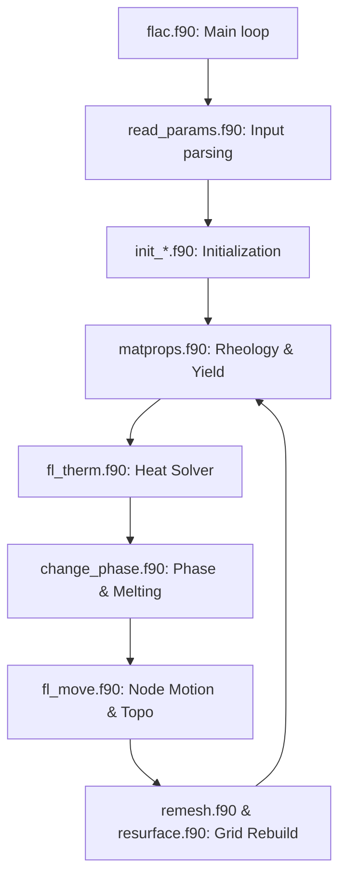

# GeoFLAC Developer Guide: Codebase Architecture & Build System

This document provides a technical overview of the GeoFLAC codebase structure, modular solver architecture, and build configuration for developers maintaining or extending the code.

---

## 1. Directory Layout

The GeoFLAC repository is structured as follows:

*   **`src/`**: The core Fortran 90 solver source code, including headers, math libraries, and the compilation Makefile.
*   **`util/`**: Post-processing and analysis utility scripts (e.g., VTK converters, plotting scripts).
*   **`examples/`**: Step-by-step benchmark tutorials (directories starting with `tutorial*`) and input templates.
*   **`doc/`**: Documentation split into user references (root level) and internal code guides ([`doc/developer/`](./)).

---

## 2. Core Solver Modules

The execution flow of GeoFLAC is modular, with the main time loop driving thermal, mechanical, and phase transitions.



### A. Core Modules Map
*   **`src/flac.f90`**: The main entry point of the executable. Initializes the global arrays, sets up the parallel acceleration runtime, and runs the primary transient time-stepping loop.
*   **`src/read_params.f90`**: Parses the `.inp` parameter file, mapping the input keys to variables defined in `src/params.f90`.
*   **`src/init_cord.f90` / `src/init_temp.f90` / `src/init_phase.f90` / `src/init_stress.f90`**:
    *   `init_cord`: Constructs the initial grid coordinates and applies initial topography anomalies.
    *   `init_temp`: Computes starting geotherms (oceanic plate, halfspace, or continental geotherms) based on zones.
    *   `init_phase`: Places Lagrangian markers and assigns their initial materials.
    *   `init_stress`: Equilibrates initial pressure and lithostatic stress arrays.
*   **`src/matprops.f90`**: Calculates effective density, elastic moduli, non-Newtonian viscosity (dislocation creep), and plastic yield flags (Mohr-Coulomb yield criteria with linear strain softening) for all cells.
*   **`src/fl_therm.f90`**: Solves the 2D heat advection-diffusion equation. Incorporates radiogenic heat generation and shear heating dissipation.
*   **`src/change_phase.f90`**: Evaluates thermodynamic phase change criteria (serpentinization, eclogitization, compaction) and computes partial melting fractions and dynamic magma diking/migration.
*   **`src/fl_move.f90`**: Updates node positions based on mechanical velocities, applies boundary conditions, and computes surface processes (topographic diffusion erosion/sedimentation).
*   **`src/remesh.f90` / `src/rem_cord.f90` / `src/resurface.f90`**:
    *   `rem_cord`: Rebuilds the mesh grid coordinates when elements undergo high shear.
    *   `remesh`: Interpolates history fields (velocities, stresses, temperatures) from the old deformed grid to the new grid.
    *   `resurface`: Adds/deletes Lagrangian markers near the moving free surface.

---

## 3. The Build System

GeoFLAC uses a classic Unix `make` build system managed by the Makefile in `src/Makefile`.

### A. Compiler Flag Configurations
The default compiler is **`gfortran`** (GNU Fortran). Key flags configured in the Makefile:
*   **`-O3`**: High-level compiler optimizations.
*   **`-ffree-form`**: Compiles source code in free-form syntax (`.f90` files).
*   **`-ffree-line-length-none`**: Prevents compilation errors due to warnings about lines exceeding the standard 132-character limit.
*   **`-fopenmp`**: Enables multi-threaded CPU parallelization.

To build the executable:
```bash
cd src/
make
```
This produces the binary executable `flac` in the `src/` directory.

### B. Snapshots and Code Dates (`take-snapshot`)
To ensure reproducibility, GeoFLAC embeds compiling metadata (such as git commit SHA-1 or snapshots) into the executable so that output logs document exactly which codebase version was run.
*   **`make take-snapshot`**: The Makefile target that gathers the latest git log commits and builds a local snapshot of untracked changes, saving the baseline version details. If origin remote references are missing during compilation on external runner environments, the snapshot pipeline uses quiet fallback flags (`2>/dev/null || true`) to prevent compilation failure.

---

## 4. Continuous Integration (CI)

GeoFLAC includes automated build validation on every commit using **GitHub Actions** (configured in [`.github/workflows/build.yml`](../../.github/workflows/build.yml)):
*   **Runner Environment**: Runs on both Linux (`ubuntu-latest`) and macOS (`macos-latest`).
*   **macOS Dependencies**: Uses Homebrew (`brew`) to install dependencies like OpenMPI. To bypass tap blockages during compilation on macOS runners, the workflow automatically untaps problematic remote taps:
    ```bash
    brew untap aws/tap || true
    ```
