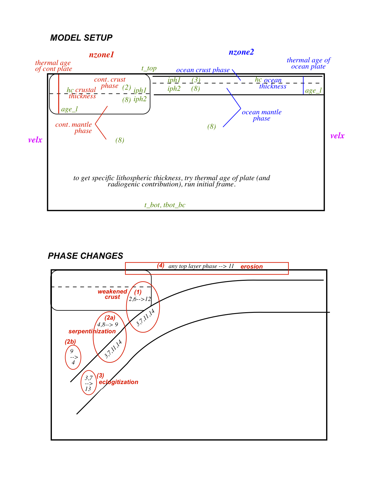

# INPUT PARAMETER FILE FOR GEOFLAC
### (by David Okaya & Eh Tan - November 2011)

-----------------------------------------------------------------------------

### Notes:

1. This document is in Markdown format and is best viewed online at [this link](https://github.com/tan2/geoflac/doc/input_description.md).

2. Any number of comment lines can be present and are preceded by a semi-colon.

3. If the line contains more than one parameter, the parameters are separated by spaces and/or optional comma.

4. The parameter name is directly taken from the source code. Due to markdown syntax, some parameter names that contain '_' (underscore) are replaced with '-' (hyphen).

5. Parameters in italic are repeated for #lines based on the prior parameter. E.g.,

    **n**

    **_value1(i), value2(i),_** .... (this item repeats **n** times. If **n**=0, then NO italic line should be given.)

6. All parameters are in **SI units** (meter, kilogram, second, Pascal, ...), unless specified. The temperature is in Celsius.

7. A diagram showing the geometry and phase changes of a subduction model. 

----
## MESH PARAMETERS

| Parameters  | Types |  Description  |
|:------------|:-----:|:--------------|
|**nex, nez** | 2 int | # of *elements* in X and Z directions.|
|**x0, z0** | 2 dbl | Beginning coordinates (Upper Left).|
|**rxbo, rzbo** | 2 dbl | Size: width from left (positive), vertical thickness (negative), or coordinate value of Lower Right corner (depth is negative).|
|**ircoord, coordfile** | int,str | if **ircoord**=1, read the initial coordinates from the file.|

* In each direction of the mesh, #nodes = #elems + 1 (one more nodes than elements or cells), i.e. **nx** = **nex**+1 and **nz** = **nez**+1.
* First three lines define element spacing of uniform grid. dx = **(rxbo-x0)/nex**, dz = **(rzbo-z0)/nez**. In general, it is good to have dx = dz (square elements).
* The **coordfile**, if exists, should contain **nx*nz** lines of (x, z) coordinates.

| Parameters  | Types |  Description  |
|:------------|:-----:|:--------------|
|**nzonx** (>=0) | int | #Zones in X-direction (0-uniform grid, max 10).|
|**_nelz-x(i), sizez-x(i)_** | int,dbl | #Elems in this zone, size of zone (non-dimensional; percentage of **rxbo**). Sum of all **nelz-x(i)** must == **nex**; sum of all **sizez-x(i)**= 1.0).|
|**nzony** (>=0) | int | #Zones in Z-direction (0-uniform grid, max 10).|
|**_nelz-y(i), sizez-y(i)_** | int,dbl | #Elems in this zone, size of zone (non-dimensional; percentage of **rzbo**). Sum of all **nelz-y(i)** must = **nez**; sum of all **sizez-y(i)** = 1.0).|

* These parameters define non-uniform structured mesh grid.

## MECHANICAL CONDITIONS

| Parameters  | Types |  Description  |
|:------------|:-----:|:--------------|
|**nystressbc, nydrsides** | 2 int | Stress boundary conditions, lithostatic stress BC on the sides.       Both are 0-No, 1-Yes.|
|**nofbc** | int | # of boundary conditions (i.e., how many segments, max 20).|
|**_nofside(i),nbc1(i),nbc2(i),nbc(i),bca(i),bcb(i),bcc(i),bcd(i),bce(i),bcf(i),bcg(i),bch(i),bci(i)_**|  4 int, 9 dbl | See the following text. |

* There are four sides (**nofside**) for a rectangular domain. 1-left, 2-bottom, 3-right, 4-top. Additional special situation: 5 for push at mid-plate.
* Each side is composed of one or more segments.  Each segment with its own BC behavior.  The starting and ending nodes of each segment are **nbc1** and **nbc2**.
* When **nofside**=5, the plate between i=[**nbc1**,**nbc2**] and j=[1,moho_grid * 2] is pushed at a constant velocity Vx. (**nbc** must be 10 in this case.)
* These are the following types of boundary conditions (**nbc**):
    +  1 - velz
    +  2 - shear stress (x,z) plane
    + 10 - velx 
    + 20 - normal stress
    + 30 - vely (strike slip version). (Experimental, used at your own risk.)
    + 40 - shear stress out of the plane. (Experimental, used at your own risk.)
    + 50 - velx with visc-dep profile. (Experimental, used at your own risk.)
* If the BC is a velocity in x or z, it is provided in units of meters/sec, a very small number.  For reference, 1 mm/year = 1 km/myr = 3.17E-11 m/s.
* The BC function **fbc(s) = a + b S + c S^2 + (d cos (2pi e S) + f sin (2pi g S))*exp(-(S - i)^2 h^2 )** is measured *along this segment* as the length ratio. **S** is normalized between 0~1, i.e. **S** = (node-in-segment - **nbc1**) / (**nbc2** - **nbc1**).

| Parameters  | Types |  Description  |
|:------------|:-----:|:--------------|
|**nyhydro,pisos,iphsub,drosub,damp-vis**| int,dbl,int,2 dbl | Winkler-type boundary condition, ie. the bottom boundary is open for flow passing through in and out. Effectively, the bottom is supported by an inviscid fluid.  See below. |
|**g**| dbl | Acceleration of gravity.  (typically 9.81 or 10).|

* **nyhydro**: 0-no, 1-yes (manual), 2-yes (auto). If 2, the reference hydrostatic pressure is computed from the column of elements at the _right_ boundary (defined in init_stress.f90).
* **pisos**: reference hydrostatic pressure at the bottom boundary (used when **nyhydro**=1). Calculated automatically if **nyhydro**=2.
* **iphsub**: substratum phase (see _PHASE_ Section below) of the inviscid fluid (whose density affects the restoration stress at the bottom).
* **drosub**: additional density difference of the fluid.
* **damp-vis**: not used.
* NOTE: Use nyhdro=2, typically iphsub=8 (mantle phase).

## THERMAL CONDITIONS

| Parameters  | Types |  Description  |
|:------------|:-----:|:--------------|
|**i-prestress**| int | Let model equilibrate given initial state, by running model for 600 kyrs before any BC changes are allowed (0-no, 1-yes).  Temperature and stress will redistribute; topography, and mountain roots will isostatically adjust.|
|**itherm**| int | 1-mechanical+thermal calculation, 2-no mechenical. NOTE: usually itherm=1.|
|**istress-therm**| int | Add thermal stress (0-no, 1-yes). |
|**ishearh**| int | Add shear heating.|
|**t-top**| dbl | Surface temperature in Celsius. Boundary AND initial condition.|
|**t-bot**| dbl | Bottom temperature in Celsius. ONLY initial condition. (The bottom TBC is given by **bot-bc** below.)|
|**hs, hr**| 2 dbl | Radiogenic heating of crust: W/kg (~1.e-9). Radiogenic e-folding depth: km.|
|**itemp-bc, bot-bc**| int, dbl | Thermal boundary conditions at the bottom (1-T, 2-Flux). If **itemp-bc**=1, **bot-bc** is the temperature in Celsius. If itemp-bc=2, bot-bc is the heat flux in mW/m2.|
|**irtemp**| int | Initial thermal distributions from a file? 0-no, 1-yes.|
|**tempfile**| string | Filename containing temperature distribution. When **irtemp**=0, this file is read.  File format is one column of temperatures written in blocks of nz, looping over nx.  E.g., `do ix=1,nx; do iz=1,nz; read T(iz,ix); enddo; enddo;`|
|**time-scale** | dbl | not used.|

## INITIAL STRUCTURE

| Parameters  | Types |  Description  |
|:------------|:-----:|:--------------|
|**nzone-age**| int | # zones of different thermal and phase structures (max 32). |
|**_ictherm(i),age-1(i),tp1(i),tp2(i),ixtb1(i),ixtb2(i)_**| int, 3 dbl, 2 int | See below. |
|**_nph-layer(i), hc(1, 2, ..., N-1)_**| int (N), N-1 dbl | depths of layer interfaces (km) |
|**_iph-col(1, 2, ..., N-1, N)_**| N int | phase of each layer |
* When **nzone-age** is greater than 0, the initial model will be divided into several columns. Each column has **nph-layer** layers of materials and its own thermal parameters.
* **ictherm**: type of initial thermal condition:
    + 1: oceanic geotherm (half-space cooling model). **age-1** is the  thermal age (Myrs) of the plate.
    + 2: oceanic geotherm (plate cooling model). **age-1** is the  thermal age (Myrs) of the plate. **tp1** is the plate thickness (km).
    + 12: continental geotherm (plate cooling model with radiogenic heating in the crust). **age-1** is the  thermal age (Myrs) of the plate. **tp1** is the plate thickness (km). **tp2** is the Moho depth (km). Radiogenic parameters **hs** and **hr** from above.
    + 21: constant geothermal gradient for the top layer, then constant **t-bot** to the bottom. **age-1** is the layer thickness (km).
    + 22: constant geothermal gradient for the top two layers, then constant **t-bot** to the bottom. **age-1** is the temperature at the layer interface, **tp1** is top layer thickness (km). **tp2** is the combined top 2 layers thickness (km).
* **nph-layer**: # (N) of layers in this zone (max 10)
    + **hc(1, 2, ..., N-1)**: depths of layer interfaces (km).
    + **iph-col(1, 2, ..., N-1, N)**: phase of each layer.
* **ixtb1, ixtb2**: left and right side of zone in nodes.
* If two consequent zones have the same phases and **ixtb2**=-1 for the former zone and **ixtb1**=-1 for the later zone, the depths of layer interfaces and thermal ages will gradualy change within the two zones.

## PHASES & RHEOLOGY

There are some phases (rock types) that are defined for this code (see phases.f90).  Users can add 5 more.  Users should not override these original 16 phases, because they are involved in phase changes (see change\_phase.f90 for details).

The predefined phases are:

 1.  basalt (anhydrate)
 2.  continental crust,  same as #6.
 3.  basalt (oceanic crust), same as #7.
 4.  olivine (mantle),  same as #8.
 5.  schist, transformed from #17
 6.  continental crust, same as #2.
 7.  basalt (oceanic crust), same as #3.
 8.  olivine (mantle), same as #4.
 9.  serpentinite (weak mantle), transformed from mantle (#4, #8) if residing above subducted oceanic crust and sediment (#3, #7, #10).  Will transform to hydrated mantle (#16) when T-P conditions are high enough.
10. sedimentary rock, compacted from (#11)
11. sediment, uncompacted, generated by erosion.
12. weak continental crust, transformed from continental crust (#2, #6) if residing above oceanic crust, sediment, or arc (#3, #7, #10, #14).
13. eclogite, transformed from basal (#1, #3, #7) when T-P conditions are high enough.
14. arc crust, generated by arc volcanism
15. weak middle crust, transformed from continental crust (#3, #7) if stressed and heated. Disabled.
16. hydrated mantle, will transform (partially melt) to mantle (#4) if warmer than olivine wet solidus and generate arc (#14) at surface.
17. metamormpic sedimentary rock, transformed from (#10)

Phase changes are activated and will take place among certain of the defined phases.

* When oceanic crust (#3, #7, #10, #14) subducts under continent (#2, #6), this original continent crust  becomes "weak". cont. crust #2, #6 ----> #12 weak crust
* When oceanic crust (#3, #7, #10) is subducted under overlying mantle (#4, #8) (e.g., mantle wedge),  this overlying mantle will serpentinize.  This serpentinite will transform back to #16 when brought to greater depth, and further transform back to #4 if partially melted. ocean mantle #4, #8 ---->  #9 serpentini ----> #16 hydrated mantle -> #4 mantle
* Basalt (oceanic crust) will transform into eclogite. basalt (oceanic crust) #1, #3, #7 ----> #13 eclogite
* Erosion produces sediments (#11) at top layer ----> low (P,T) conditions compaction and diagenesis to sedimentary rock (#10) ----> medium (P,T) condition to metamorphic sedimentary rock (#17) ----> high (P,T) condition to schist (#5)

| Parameters  | Types |  Description  |
|:------------|:-----:|:--------------|
|**nphase**| int | Number of different types of phases (materials), max. 20.|
|**_irheol(i),visc(i), den(i), alfa(i),beta(i), pln(i),acoef(i),eactiv(i), rl(i),rm(i), plstrain1(i),plstrain2(i), fric1(i),fric2(i), cohesion1(i),cohesion2(i), dilat1(i),dilat2(i), conduct(i),cp(i), ts(i),tl(i),tk(i),fk(i)_**| int, 24 dbl | See below.|

+  **irheol**: Rheology for this phase (see below).
    + 1- elastic,
    + 3- visco-elastic (Maxwell, Non-Newtonian)
    + 6- elasto-plastic (Mohr-Coulomb)
    + 11- visco-elasto-plastic (Mohr-Coulomb + Fixed Maxwell, Newtonian).
    + 12- visco-elasto-plastic (Mohr-Coulomb + Maxwell, Non-Newtonian). This is the only rheology that is under active use and maintained.
+  **visc**:  not used.
+  **den**:  density at 0 Pa and 0 Celsius.
+  **alfa**:  coeff. of thermal expansion.
+  **beta**: compressibility. How the density increases with pressure.
+  **pln**:  n for viscosity power law
+  **acoef**: A for viscosity power law
+  **eactiv**: E - activation energy for viscosity
+ The non-newtonian viscosity is calculated by this equation: visc = 0.25e6 (0.75 **acoef**)^(-1/**pln**) *strain-rate*^(1/**pln** - 1) exp[ **eactiv** / (**pln** *R* (*T* + 273))]. Where *strain-rate* is the second invariant of the deviatoric strain rate, *R* is the gas constant, *T* is the temperature.
+  **rl**:  Lame parameter: lambda
+  **rm**:  Shear modulus: mu
+ Under tectonic time scale, the elastic constants are different from that from seismic waves.
+  **plstrain1**: Mohr-Coulomb: plastic strain of onset softening
+  **plstrain2**: Mohr-Coulomb: plastic strain of saturated softening
+  **fric1**: Mohr-Coulomb: friction angle before softening
+  **fric2**: Mohr-Coulomb: friction angle of saturated softening, in degree
+  **cohesion1**: Mohr-Coulomb: cohesion before softening
+  **cohesion2**: Mohr-Coulomb: cohesion of saturated softening, in Pa
+  **dilat1**: Mohr-Coulomb: dilation angle before softening, non-associated plastic flow.
+  **dilat2**: Mohr-Coulomb: dilation angle of saturated softening, in degree
+ The Mohr-Coulomb yield stress is **cohesion** + *tan*(**fric**) *normal-stress*. The non-associated plastic flow with strain softening is used.
+ Most material starts with 0 plastic strain. The yield stress is calculated from the pre-softening parameters (**fric1**, **cohesion1**, **dilat1**).
+ When the plasitc strain is greater than **plstrain1**, softening begins. The Mohr-Coulomb parameters are linear interpolated.
+ When the plasitc strain is greater than **plstrain2**, softening saturates, and the yield stress is calculated from the pre-softening parameters (**fric2**, **cohesion2**, **dilat2**).
+  **conduct**: thermal conductivity
+  **cp**:  heat capacity at constant pressure, J/(kg C)
+  **ts**:  solidus temperature, only used for the hydrated mantle phase.
+  **tl**:  liquidus temperature, only used.
+  **tk**:  latent heat of fusion temperature, not used.
+  **fk**:  coeff of latent heat of fusion, not used.

## INITIAL PHASE DISTRIBUTION

| Parameters  | Types |  Description  |
|:------------|:-----:|:--------------|
|**irphase**  | int   | Flag to take initial phase distribution from a file: 0-N, 1-Y. |
|**phasefile**| string| Filename containing initial phase distribution. |

* If **irphase**=1, read **phasefile** for the initial phase of each element.
* **phasefile** format: One column of phase id by element (not by node). Vertical fast, horz slow. dimensions.

## INITIAL INHOMOGENEITIES
| Parameters  | Types |  Description  |
|:------------|:-----:|:--------------|
|**inhom**    | int   | Number of inhomogeneities (up to 50). |
|**_ix1(i), ix2(i), iy1(i), iy2(i), inphase(i), igeom(i), xinitaps(i)_**| 6 int, dbl | See below.|

* The initial phase, temperature, topography can be modified by adding some inhomogeneities.
* The type of inhomogeneities is determined by **igeom**.
* Add phase inclusion or weak zone (initial plastic strain, see init_phase.f90)
    - 0 rectangular inclusion
    - 1,2 (obsolete, don’t use)
    - 3 diagonal line inclusion
    - 4 diagonal line inclusion plus init. plastic strain
    - if rectangular, upper left corner is **ix1-iy1**, lower right corner is **ix2-iy2** (in elements).
    - if diagonal line, **ix1** < **ix2**, but the vertical **iy1-iy2** can be any values, in order to define  diagonal slope polarity (e.g., **iy1** > **1y2** for dipping towards left).
* Add temperature anomaly (see init_temp.f90), **xinitaps** as the amplitude of anomaly, **inphase** not used.
    - 11 Gaussian shape (halfwidth=**ix1-ix2**, amplitude=amp), depth between **iy1-iy2**
    - 13 right slanting temp. inhom.
    - 14 left slanting temp. inhom.
* Add topography (see init_cord.f90), **xinitaps** as the amplitude of topography, **inphase** not used.
    - 20 square, surface nodes ix1-ix2 elevated by **xinitaps**
    - 21 trapzoidal, surface nodes linearly increase **ix1-ix2**, flat **ix2-iy1**, decrease **iy1-iy2**, max. elevated by **xinitaps**
* Cause a low viscosity zone, where the visocsity is always **v-min**.
    - 100 rectangular zone

## MISC. PARAMETERS

| Parameters  | Types |  Description  |
|:------------|:-----:|:--------------|
|**ten-off**  |  dbl  | Tension cut-off. |
|**tau-heal** |  dbl  | Healing time. 0 for no healing. For healing, use 1e13 ~ 0.3 myr. |

* Plastic strain can heal over time by exponentially decays with time.

| Parameters  | Types |  Description  |
|:------------|:-----:|:--------------|
|**v-min, v-max, ivis-shape, efoldc**| 2 dbl, int, dbl| Viscosity limits. See below. |

* **v-min**: Minimum viscosity cut-off. If the visc. is too small, the maxwell time scale will control how big the time step is.
* **v-max**: Maximum viscosity cut-off.
* **ivis-shape** and **efoldc**: not used.

| Parameters  | Types |  Description  |
|:------------|:-----:|:--------------|
|**itype-melting, nelem-serp, prod-magma, rho-magma**|2 int, 2 dbl| See below.|
|**angle-mzone, fmagma-max, ratio-mantle-mzone**|4 dbl| See below.|
|**latent-heat-magma, lambda-freeze, lambda-freeze-tdep**|3 dbl| See below.|
|**weaken-ratio-plastic, weaken-ratio-viscous**|2 dbl| See below.|

* **itype-melting**: 0 for no melting. 1 for arc-type melting.
* **nelem-serp**: the thickness (# elements) of serpentinization zone above subducted oceanic crust.
* **prod-magma**: the production rate of magma migrating away from the active melting (m^3 of magma/m^3 of melt/second)
* **rho-magma**: the density of magma (kg/m^3)
* **angle-mzone**: angle (in degree) of the magma zone in the mantle
* **fmagma-max**: max volume ratio of magma
* **ratio-mantle-mzone**: ratio of magma staying in the mantle. It will affect how much magma resides in the mantle wedge, respectively.
* **latent-heat-magma**: the latent heat of magma freezing (J/kg)
* **lambda-freeze, lambda-freeze-tdep**: temperature-dependent decaying constant of magma (ie. freezing) M(dt)=M(0)*(1-lambda*dt), where lambda = **lambda-freeze** x exp(-**lambda-freeze-tdep** x (T - **t_top**)). These will affect how long magma can remain in the mantle wedge. Additionally, more freezing will release more latent heat and increase the temperature in the mantle wedge.
* **weaken-ratio-plastic, weaken-ratio-viscous**: Magma induced weakening for yield stress (plastic) and viscosity. Saturated at **fmagma-max**.

## REMESHING

| Parameters  | Types |  Description  |
|:------------|:-----:|:--------------|
|**ny-rem, mode-rem, ntest-rem, angle-rem**|3 int, dbl| See below.|
|**dx-rem**   | dbl   | remeshing criteria for mode-rem=3 or 11. |
|**topo-kappa, fac-kappa**| 2 dbl | Erosion diffusion of topography. |

* **ny-rem**  Activate remeshing? 0-no, 1-yes.
* **mode-rem**  Mode
    - 1: keep 4 sides as is. 
    - 3: L,R,B restored to initial sides, top as is.
    - 11" L,R restored to initial sides, top,bottom as is.
* **ntest-rem**  #time steps to test if remeshing needed.
* **angle-rem**  critical angle (in degree) to trigger remeshing.
* **dx-rem** critical distance of shortening for **mode-rem**=3 or 11. Normalized size = **rxb0/nex**. 
* The surface topography can change due to erosion and sedimentation, which is modeled as hill slope diffusion (see fl_move.f90). The diffusivity is controlled by **topo-kappa**. Use 0 for no erosion, 1e-5 or larger for strong erosion.

## PROCESS CONTROL

| Parameters  | Types |  Description  |
|:------------|:-----:|:--------------|
|**idt-scale**| int   | Inertial mass scaling.  0-no scale for DYNAMICS.  1-scale for STATICS. 2-Automatic scaling (USE THIS).|
|**dt-scale, strain-inert**| 2 dbl | control of time step size; **dt-scale** is used if **idt-scale**       =1. **strain-inert** is used if **idt-scale**=2. Decrease it if the model gives NaN or Inf result.|
|**i-rey, xReyn**| int dbl | Buoyancy + Reynolds (no-0,yes-1), Reynolds number |
|**ifreq-rmasses**| int | Frequency of re-evaluation of real masses |
|**ifreq-imasses**| int | Frequency of re-evaluation of inertial masses |
|**ifreq-visc**|  int | Freq. re-evaluation Non-Newtonian VISC (rheol.eq.12) |
|**ifreq-avgsr**| int | freq. averaging strain rate and dissipation |
|**frac, fracm**| 2 dbl | calculate time step scales |
|**movegrid, ndim**| 2 int | **movegrid**: 0-N, 1-Y. **ndim**: =2 normal cases; =3 in/out of plane stress.|
|**demf, mix-strain, mix-stress**| dbl 2 int | **demf** damping coefficient. Mixing Procedures:	**mix-strain**: 0-no, 1-yes. **mix-stress**: 0-no, 1-yes.|

## OUTPUT PARAMETERS

#### Time parameters below are in thousands years (kyrs)

| Parameters  | Types |  Description  |
|:------------|:-----:|:--------------|
|**time-max** | dbl   | Max time of calculations (in kyrs). |
|**dtout-screen**| dbl| Time interval for screen output of calc. progress. |
|**dtout-file**| dbl  | Time interval for file output (frequency of output). |

#### Variables to print to file:   0-no, 1-yes
| Parameters  | Types |  Description  |
|:------------|:-----:|:--------------|
|**io-vel,io-srII,io-eII,io-aps,io-sII,io-sxx,io-szz,io-sxz,io-pres,io-temp,io-phase,io-visc,io-unused,io-density,io-src,io-diss,io-forc,io-hfl,io-topo**| 19 int | See below.|

* **io-vel**  Velocity (Vx,Vz) in cm/year.       vx.0, vz.0
* **io-srII**  Deviatoric strain rate - second invariant, log10().  srII.0
* **io-eII**  Dev. strain - second invariant, first invariant.        eII.0, eI.0
* **io-aps** Total accumulated plastic strain    aps.0
* **io-sII**  Dev. stress - sqrt(second invariant), in kbars  sII.0
* **io-sxx** Dev. stress – xx component, in kbars   sxx.0
* **io-szz**  Dev. stress – zz component, in kbars   szz.0
* **io-sxz** Stress - xz (shear) component,  in kbars   sxz.0
* **io-pres** Pressure, in kbars       pres.0
* **io-temp** Temperatur, in Celsius      temp.0
* **io-phase** Phase # (1-n as defined in input file).   phase.0
* **io-visc** Viscosity, log10(Pa-s)      visc.0
* **io-unused** unused
* **io-density** Density, in kg/m       density.0
* **io-src**  Heat source.       src.0
* **io-diss** Energy dissipation = shearheat/dens/radiog-heat diss.0
* **io-forc** Force: at left, right boundaries    forc.0
* **io-hfl**  Surface heat flow (1-D)      hfl.0
* **io-topo** Topography (1-D), in km     topo.0
* By default, these always produced:
    * Time of each output panel in sec  time.0
    * Mesh coordinates (z,x)x, (z,x)z in km    mesh.0

| Parameters  | Types |  Description  |
|:------------|:-----:|:--------------|
|**lastout**  | int   | Output for last step only (1) or each nout step (0) 0=append, 1=override in output file. |
|**dtsave-file**| dbl | Time interval for process saving (in Kyrs). For restart *.rs files. |
|**lastsave** | int   | Saving the last step only (1) or each nsave step (0). To restart,  (a) copy -contents.save -> _contents.rs  (b) rerun flac with the same input parameters.|

#### END OF FILE
