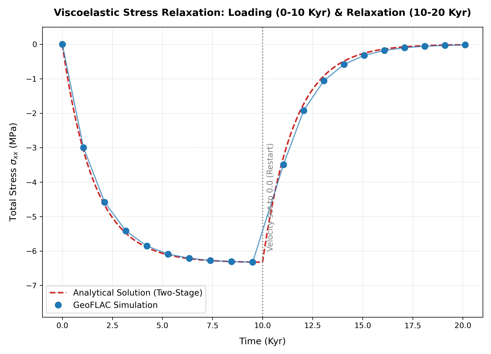

# GeoFLAC Tutorial: Viscoelastic Maxwell Loading & Relaxation (Restart)

This tutorial explains the setup, boundary conditions, physical results, and analytical verification of the two-stage viscoelastic Maxwell loading and relaxation benchmark in **GeoFLAC**, utilizing the native checkpoint save-and-restart mechanism.

---

## 1. Running the Simulation and Plotting

To demonstrate the physical behavior of a Maxwell body under both constant strain rate (loading) and constant strain (relaxation), we run the simulation in two stages:
1. **Stage 1 (0 to 10.0 Kyr)**: Compress the viscoelastic column at a rate of $0.1\text{ cm/yr}$, letting compressive stress build up.
2. **Stage 2 (10.0 to 20.0 Kyr)**: Restart the simulation using a second input file where the boundary velocity is set to `0.0`, letting the built-up stress relax viscously.

### How Restarting Works in GeoFLAC
* **Save States**: When the solver reaches a process saving interval, it writes the binary coordinates, stresses, velocities, and marker arrays to `.rs` files (e.g. `time.rs`, `vel.rs`, `phase.rs`, `marker1.rs`). 
* **Checkpoint Registry**: It registers the step number and physical time of the last save in `_contents.save`.
* **Restart Trigger**: When you run the solver, if a file named `_contents.rs` exists in the execution directory, it will read `_contents.rs`, load the saved binary `.rs` files, and resume execution. If `_contents.rs` is absent, it starts a fresh run.

### Step 1: Run Stage 1 (0 to 10.0 Kyr)
Clean the output directory of any past run files and execute the solver with the loading input file:
```bash
rm -f *.0 *.rs *.vts _contents.* _markers.* pisos.rs time.rs vbc.s output.asc sys.msg
../../src/flac maxwell.inp
```
The solver will run up to 10.0 Kyr, write the first 11 frames of output (every 0.99 Kyr), and save the final checkpoint to `_contents.save`.

### Step 2: Stage the Restart Checkpoint
Copy the checkpoint registry to the active restart filename:
```bash
cp _contents.save _contents.rs
```

### Step 3: Run Stage 2 (10.0 to 20.0 Kyr)
Resume the simulation using the relaxation input file `maxwell_relax.inp` (which has the left boundary velocity set to `0.0` and the max time set to `20.0` Kyr):
```bash
../../src/flac maxwell_relax.inp
```
The solver detects `_contents.rs`, prints `you have RESTART start conditions`, loads the 10.0 Kyr binary state, and continues calculations up to 20.0 Kyr.

### Step 4: Plot the Stress Loading and Relaxation Curve
Run the plotting script:
```bash
python3 plot_viscoelastic.py
```
This script reads the binary files, reconstructs the total horizontal stress $\sigma_{xx}$, and plots the simulation points alongside the two-stage analytical curve, saving the plot as `images/stress_relaxation.png`.

---

## 2. Model Setup

The model represents a vertical two-dimensional column of homogenous viscoelastic rock undergoing horizontal compression. Under compression, the material exhibits both transient elastic stress build-up and long-term viscous relaxation governed by a Newtonian Maxwell rheology.

### Geometry and Mesh
* **Dimensions**: 20 km wide ($X \in [0, 20]$ km), 5 km high ($Z \in [-5, 0]$ km).
* **Grid Resolution**: $40 \times 10$ elements in the $X$ and $Z$ directions, yielding a regular grid of square elements ($500 \times 500$ m).

### Material Properties
The material is a Newtonian Maxwell viscoelastic rock defined in the input files with the following parameters:
* **Rheology Type (`irheol`)**: Set to `3` (Visco-elastic, Maxwell, Non-Newtonian) in the input file. Refer to the [Rheology Types table](../../doc/input_description.md#phases--rheology) for other options.
* **Lamé constant ($\lambda$)**: $3.0 \times 10^{10} \text{ Pa}$ (`Lame:rl`)
* **Shear Modulus ($\mu$)**: $3.0 \times 10^{10} \text{ Pa}$ (`Lame:rm`)
* **Newtonian Viscosity ($\eta$)**: $1.0 \times 10^{21} \text{ Pa}\cdot\text{s}$
* **Density ($\rho$)**: $2700 \text{ kg/m}^3$ (`den`)
* **Gravity ($g$)**: $0.0 \text{ m/s}^2$ (pure compression without gravity-induced pre-stress or hydrostatic gradients).

> [!NOTE]
> **Formulating Newtonian Viscosity in GeoFLAC:**
> Because GeoFLAC models viscosity using power-law creep ($\dot{\epsilon} = A \sigma^n$), we simulate Newtonian Maxwell rheology by setting:
> * Power exponent $n = 1.0$ ([`pln = 1.0`](../../doc/input_description.md#phases--rheology))
> * Zero thermal and pressure activation dependencies ([`eactiv = 0.0`, `vactiv = 0.0`](../../doc/input_description.md#phases--rheology))
> * The pre-exponential coefficient [`acoef`](../../doc/input_description.md#phases--rheology) calculated from viscosity as:
>   $$\text{acoef} = \frac{10^6}{3 \eta} = 3.3333333 \times 10^{-16}$$
> * The viscosity limit bounds in the input files are set to `1.0e+18` and `1.0e+25` so the target $10^{21} \text{ Pa}\cdot\text{s}$ is safely inside the range.

---

## 3. Boundary Conditions

The mechanical boundary conditions are configured to deform the column in two stages:

### Stage 1: Viscoelastic Loading (`maxwell.inp`)
1. **Left Boundary ($X = 0$ km, Side 1)**:
   * Constrained to move horizontally inward (to the right) at a constant velocity of $V_x = 0.1 \text{ cm/yr} \approx 3.1687686 \times 10^{-11} \text{ m/s}$.
   * Free to move vertically (zero vertical shear traction).
2. **Right Boundary ($X = 20$ km, Side 3)**:
   * Constrained horizontally to zero velocity ($V_x = 0.0$ m/s, forming a rigid wall).
   * Free to move vertically (free-slip boundary condition).
3. **Bottom Boundary ($Z = -5$ km, Side 2)**:
   * Constrained vertically to zero velocity ($V_z = 0.0$ m/s).
   * Free to expand/slide horizontally (free-slip boundary condition).
4. **Top Boundary ($Z = 0$ km, Side 4)**:
   * Completely free of traction ($\sigma_{zz} = 0.0$ and $\sigma_{zx} = 0.0$).

### Stage 2: Stress Relaxation (`maxwell_relax.inp`)
* The left boundary velocity is set to $V_x = 0.0$ m/s (zero incoming velocity).
* All other boundary conditions remain identical to Stage 1. This fixes the horizontal width of the column, causing the built-up stress to relax viscously under constant strain.

---

## 4. Simulation Results

### Stress Evolution
The simulation captures the two-stage stress profile with exceptional detail:
* **0 to 10.0/Kyr**: The stress builds up elastically, starting to approach the Newtonian steady-state level of $-6.3375$ MPa.
* **10.0 to 20.0/Kyr**: The stress decays exponentially back toward zero.

### Verification Chart
The generated plot is saved to `images/stress_relaxation.png`:



1. **Blue Dots / Line**: The simulation output points spaced at 0.99/Kyr intervals, showing the loading and subsequent relaxation curves.
2. **Red Dashed Line**: The theoretical analytical relaxation curve showing the elastic stress build-up during Stage 1 and the exponential stress decay during Stage 2.

The extremely close fit confirms the physical validity and high numerical precision of **GeoFLAC**'s viscoelastic mechanical solver.

*Note: Total horizontal stress is reconstructed by summing deviatoric stress ($\sigma'_{xx}$) and mean stress ($\sigma_m$, stored as a negative value under compression in `pres.0`):
$$\sigma_{xx} = \sigma'_{xx} + \sigma_m$$
Please refer to the Elastic tutorial for a detailed breakdown of stress decomposition and Kilobar-to-MPa conversion in GeoFLAC.*

---

## Appendix: Analytical Formulation & Viscoelastic Flow

Under 2D plane strain ($\epsilon_{yy} = 0$) and a free top surface ($\sigma_{zz} = 0$), the total horizontal compressive stress $\sigma_{xx}(t)$ is formulated for the two stages:

### Stage 1: Viscoelastic Loading ($0 \le t \le 10.0$ Kyr)
$$\sigma_{xx}(t) = \sigma_{xx}^{steady} \left( 1 - e^{-t/\tau_{eff}} \right)$$

where:
1. **Horizontal Strain Rate ($\dot{\epsilon}_{xx}$)**:
   $$\dot{\epsilon}_{xx} = \frac{V_x}{L} = \frac{-0.001 \text{ m/yr}}{20000 \text{ m}} \approx -1.584384 \times 10^{-15} \text{ s}^{-1}$$
2. **Effective Viscous Resistance**:
   Under plane strain Newtonian flow, the effective viscosity resisting horizontal contraction is $\eta_{eff} = 4\eta$.
   $$\sigma_{xx}^{steady} = 4\eta\dot{\epsilon}_{xx} = 4 \times 10^{21} \text{ Pa}\cdot\text{s} \times (-1.584384 \times 10^{-15} \text{ s}^{-1}) = -6.3375 \text{ MPa}$$
3. **Effective Relaxation Time ($\tau_{eff}$)**:
   $$\tau_{eff} = \frac{\eta_{eff}}{E_{eff}} = \frac{4\eta}{\frac{4\mu(\lambda + \mu)}{\lambda + 2\mu}} = \frac{\eta (\lambda + 2\mu)}{\mu (\lambda + \mu)}$$
   Using Lamé constants $\lambda = \mu = 3.0 \times 10^{10} \text{ Pa}$:
   $$\tau_{eff} = 5.0 \times 10^{10} \text{ s} \approx 1584.38 \text{ years} = 1.584 \text{ Kyr}$$

### Stage 2: Stress Relaxation ($10.0 < t \le 20.0$ Kyr)
When the boundary velocity is set to zero, the strain rate $\dot{\epsilon}_{xx} = 0$. The stress decays exponentially from its value at the end of Stage 1 ($t_{switch} = 10.0$ Kyr):

$$\sigma_{xx}(t) = \sigma_{xx}(t_{switch}) \cdot e^{-(t - t_{switch})/\tau_{eff}}$$

where:
* $\sigma_{xx}(t_{switch}) = -6.3375 \times \left(1 - e^{-10/1.584}\right) \approx -6.3262 \text{ MPa}$
* $\tau_{eff} = 1.584 \text{ Kyr}$

### Derivation of the Effective Viscosity ($\eta_{eff} = 4\eta$)

In incompressible 2D plane strain Newtonian flow, the constitutive relationship between total stress $\sigma_{ij}$, deviatoric stress $\sigma'_{ij}$, and mean stress/pressure $P$ is:
$$\sigma_{ij} = \sigma'_{ij} - P \delta_{ij}$$
$$\sigma'_{ij} = 2 \eta \dot{\epsilon}_{ij}$$

Thus, the horizontal and vertical stress equations are:
$$\sigma_{xx} = 2 \eta \dot{\epsilon}_{xx} - P$$
$$\sigma_{zz} = 2 \eta \dot{\epsilon}_{zz} - P$$

To solve for the total horizontal stress $\sigma_{xx}$ under horizontal contraction, we apply three physical constraints:
1. **Plane Strain Condition**: The out-of-plane strain rate is zero:
   $$\dot{\epsilon}_{yy} = 0$$
2. **Incompressibility (Conservation of Volume)**: For a Newtonian fluid, the volumetric strain rate is zero:
   $$\dot{\epsilon}_{xx} + \dot{\epsilon}_{yy} + \dot{\epsilon}_{zz} = 0$$
   Substituting $\dot{\epsilon}_{yy} = 0$ yields:
   $$\dot{\epsilon}_{zz} = -\dot{\epsilon}_{xx}$$
3. **Free Surface Top Boundary**: The top boundary is a free surface, meaning vertical normal stress is zero:
   $$\sigma_{zz} = 2 \eta \dot{\epsilon}_{zz} - P = 0 \implies P = 2 \eta \dot{\epsilon}_{zz}$$
   Substituting $\dot{\epsilon}_{zz} = -\dot{\epsilon}_{xx}$ gives the pressure:
   $$P = -2 \eta \dot{\epsilon}_{xx}$$

Now, substituting this pressure $P$ back into the horizontal stress equation:
$$\sigma_{xx} = 2 \eta \dot{\epsilon}_{xx} - P = 2 \eta \dot{\epsilon}_{xx} - (-2 \eta \dot{\epsilon}_{xx}) = 4 \eta \dot{\epsilon}_{xx}$$

Therefore, the total horizontal stress resisting contraction is:
$$\sigma_{xx} = \eta_{eff} \dot{\epsilon}_{xx}$$
where the effective viscosity is:
$$\eta_{eff} = 4 \eta$$
