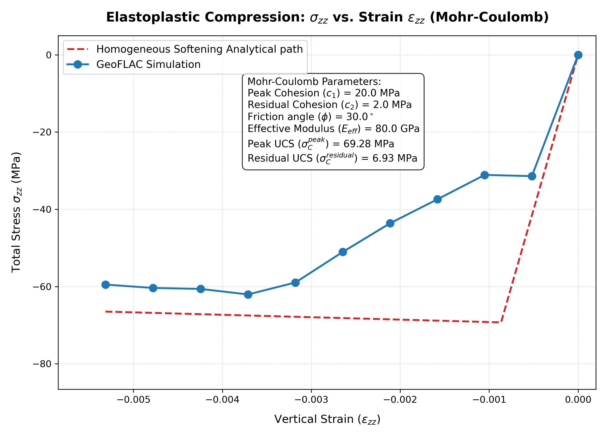

# GeoFLAC Tutorial: Mohr-Coulomb Elastoplastic Compression

This tutorial explains the setup, boundary conditions, physical results, and analytical verification of the Mohr-Coulomb elastoplastic bar compression benchmark in **GeoFLAC**.

---

## 1. Running the Simulation and Plotting

### Step 1: Run the GeoFLAC Solver
Execute the compiled `flac` binary in the directory:
```bash
rm -f *.0 *.rs *.vts _contents.* _markers.* pisos.rs time.rs vbc.s output.asc sys.msg
../../src/flac plastic.inp
```
The solver will run for 500 steps, simulating a total time of $0.5$ Kyr and writing output files `ezz.0`, `szz.0`, and `pres.0` every $0.05$ Kyr.

### Step 2: Plot the Stress-Strain Curve
Run the provided Python plotting script:
```bash
python3 plot_elastoplastic.py
```
This script reads the binary files, averages the vertical strain and total vertical stress across the domain for each output frame, plots them against the analytical Mohr-Coulomb yield path ($\sigma_C = 69.28$ MPa), and saves the figure to `images/stress_strain_yield.png`.

---

## 2. Model Setup

The model represents a vertical two-dimensional column (bar) of homogenous elastoplastic rock undergoing vertical compression. Under compression, the material behaves elastically until its state of stress satisfies the **Mohr-Coulomb yield criterion**, after which it deforms plastically at a constant yield stress.

### Geometry and Mesh
* **Dimensions**: 1000 meters wide ($X \in [0, 1000]$ m), 3000 meters high ($Z \in [-3000, 0]$ m).
* **Grid Resolution**: $10 \times 30$ elements in the $X$ and $Z$ directions, yielding a regular grid of square elements ($100 \times 100$ m).

### Material Properties
The material is a Mohr-Coulomb elastoplastic rock with strain softening defined in the input file `plastic.inp` with the following parameters:
* **Rheology Type (`irheol`)**: Set to `6` (Elasto-plastic, Mohr-Coulomb) in the input file. Refer to the [Rheology Types table](../../doc/input_description.md#phases--rheology) for other options.
* **Lamé constant ($\lambda$)**: $3.0 \times 10^{10} \text{ Pa}$ (`Lame:rl`)
* **Shear Modulus ($\mu$)**: $3.0 \times 10^{10} \text{ Pa}$ (`Lame:rm`)
* **Peak Cohesion ($c_1$)**: $2.0 \times 10^7 \text{ Pa} = 20 \text{ MPa}$ ([`coh1`](../../doc/input_description.md#phases--rheology))
* **Residual Cohesion ($c_2$)**: $2.0 \times 10^6 \text{ Pa} = 2 \text{ MPa}$ ([`coh2`](../../doc/input_description.md#phases--rheology) - defining a 90% cohesion weakening)
* **Plastic Strain weakening limits**: $[0.0, 0.1]$ ([`pls1`, `pls2`](../../doc/input_description.md#phases--rheology) - softening occurs over 10% plastic strain)
* **Friction Angle ($\phi$)**: $30.0^\circ$ ([`fric1`, `fric2`](../../doc/input_description.md#phases--rheology) - constant friction angle)
* **Dilatancy Angle ($\psi$)**: $0.0^\circ$ ([`dilat1`, `dilat2`](../../doc/input_description.md#phases--rheology) - non-associated plastic flow, no plastic volume change)
* **Density ($\rho$)**: $2700 \text{ kg/m}^3$ (`den`)
* **Gravity ($g$)**: $0.0 \text{ m/s}^2$ (pure compression without gravity-induced pre-stress or hydrostatic gradients).

---

## 3. Boundary Conditions

The mechanical boundary conditions are configured in [`plastic.inp`](plastic.inp) to compress the column vertically under unconfined conditions:

1. **Top Boundary ($Z = 0$ m, Side 4)**:
   * Constrained to move vertically downward at a constant velocity of $V_z = -1.0 \times 10^{-9} \text{ m/s}$.
   * Free to move horizontally (no shear traction).
2. **Bottom Boundary ($Z = -3000$ m, Side 2)**:
   * Constrained vertically to zero velocity ($V_z = 0.0$ m/s).
   * Free to expand/slide horizontally (free-slip boundary condition).
3. **Lateral Boundaries ($X = 0$ m and $X = 1000$ m, Sides 1 and 3)**:
   * Completely free of traction ($\sigma_{xx} = 0.0$ and $\sigma_{xz} = 0.0$).

---

## 4. Analytical Formulation (Mohr-Coulomb Yield Criterion)

The Mohr-Coulomb yield criterion describes the shear strength of rocks and soils in terms of normal and shear stresses on the failure plane:

$$\tau = c + \sigma'_n \tan \phi$$

In terms of principal stresses $\sigma_1 \ge \sigma_2 \ge \sigma_3$ (using the classical soil mechanics convention where compressive stresses are positive, so $p_1 \ge p_2 \ge p_3 \ge 0$):

$$p_1 = p_3 N_\phi + 2 c \sqrt{N_\phi}$$

where $N_\phi$ is the passive pressure coefficient:

$$N_\phi = \tan^2\left( 45^\circ + \frac{\phi}{2} \right) = \frac{1 + \sin \phi}{1 - \sin \phi}$$

### Conversion to GeoFLAC Sign Convention (Tension Positive)
In GeoFLAC, compressive stresses are negative. Let $\sigma_1$ be the maximum principal stress (least compressive, horizontal stress $\sigma_{xx}$) and $\sigma_3$ be the minimum principal stress (most compressive, vertical stress $\sigma_{zz}$). 

Substituting $p_1 = -\sigma_3$ (most compressive) and $p_3 = -\sigma_1$ (least compressive) yields the yield function $f = 0$ in principal stress space:

$$\sigma_3 = \sigma_1 N_\phi - 2 c \sqrt{N_\phi}$$

### Unconfined Compressive Strength (UCS)
Since the lateral boundaries are completely free and unconfined, the horizontal stress remains zero throughout the test ($\sigma_{xx} = \sigma_1 = 0.0$). Substituting $\sigma_1 = 0$ into the yield equation gives the **Unconfined Compressive Strength (UCS)** of the rock, denoted as $\sigma_C$:

$$\sigma_{zz}^{yield} = \sigma_3 = -2 c \sqrt{N_\phi} = -\sigma_C$$

where:
$$\sigma_C = 2 c \sqrt{\frac{1 + \sin \phi}{1 - \sin \phi}} = 2 c \tan\left( 45^\circ + \frac{\phi}{2} \right)$$

### Strain Softening Analytical path
With strain softening, cohesion decreases linearly from its peak value $c_1$ to its residual value $c_2$ as the accumulated plastic strain ($\epsilon_p$) increases from $\text{pls1}$ to $\text{pls2}$:
$$c(\epsilon_p) = c_1 + (c_2 - c_1) \frac{\epsilon_p}{\text{pls2} - \text{pls1}}$$

This yields a peak and residual unconfined compressive strength:
* **Peak Strength ($\sigma_C^{peak}$)**:
  $$\sigma_C^{peak} = 2 c_1 \tan\left( 45^\circ + \frac{\phi}{2} \right) = 2 \times (20 \text{ MPa}) \times \sqrt{3} \approx 69.282 \text{ MPa}$$
* **Residual Strength ($\sigma_C^{residual}$)**:
  $$\sigma_C^{residual} = 2 c_2 \tan\left( 45^\circ + \frac{\phi}{2} \right) = 2 \times (2 \text{ MPa}) \times \sqrt{3} \approx 6.928 \text{ MPa}$$

During yielding, the total vertical strain $\epsilon_{zz}$ is the sum of elastic and plastic components ($\epsilon_{zz} = \epsilon_{zz}^e - \epsilon_p$). Since elastic strain is $\epsilon_{zz}^e = -\sigma_C(\epsilon_p) / E_{eff}$, we can derive the homogeneous stress-strain softening path analytically:
$$\epsilon_{zz} = -\frac{\sigma_C(\epsilon_p)}{E_{eff}} - \epsilon_p = -\frac{\sigma_C^{peak}}{E_{eff}} - \epsilon_p \left[ 1 + \frac{\sigma_C^{residual} - \sigma_C^{peak}}{E_{eff} \cdot \text{pls2}} \right]$$

Thus, the vertical column deforms elastically (with effective modulus $E_{eff} = 80$ GPa) until reaching the peak stress of **$-69.282$ MPa** at strain $\epsilon_{zz}^{yield} \approx -0.000866$, after which the stress weakens progressively toward the residual plateau.

*Note: Total vertical stress is reconstructed by summing deviatoric stress and pressure: $\sigma_{zz} = \sigma'_{zz} + P$. Please refer to the Elastic tutorial for a detailed breakdown of stress decomposition and Kilobar-to-MPa conversion in GeoFLAC.*

---

## 5. Simulation Results

### Stress and Strain Evolution
The simulation captures the transition from elastic loading to progressive plastic softening with exceptional detail.

* *Note on stress softening and localization*: 
  In the simulation, the average stress peaks at **$-62.05$ MPa** (Frame 8) and then softens progressively to **$-59.49$ MPa** (Frame 11).
  There is a physical difference between the macroscopic simulation average and the homogeneous analytical softening path. This is due to **strain localization and shear banding**: in the simulation, plastic strain concentrates in narrow localized bands (shear bands). Elements within the shear bands accumulate plastic strain much faster than the homogeneous average, which accelerates their softening. This reduces the overall load-bearing capacity of the vertical column below the homogeneous analytical prediction, capturing realistic structural softening!

### Verification Chart
The generated plot is saved to `images/stress_strain_yield.png`:



1. **Blue Line**: The simulation stress-strain loading path with strain softening.
2. **Red Dashed Line**: The theoretical analytical Mohr-Coulomb path showing homogeneous elastic loading and softening.

The simulation accurately captures the transition from elastic loading to progressive plastic softening, verifying both the correct implementation and numerical stability of GeoFLAC's strain-softening mechanics.
