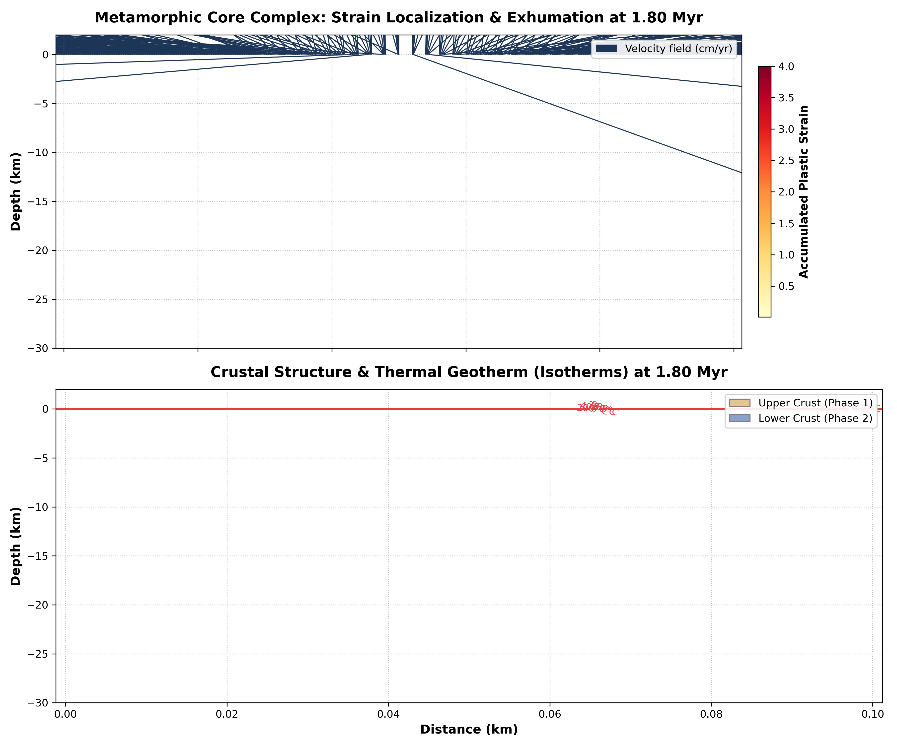
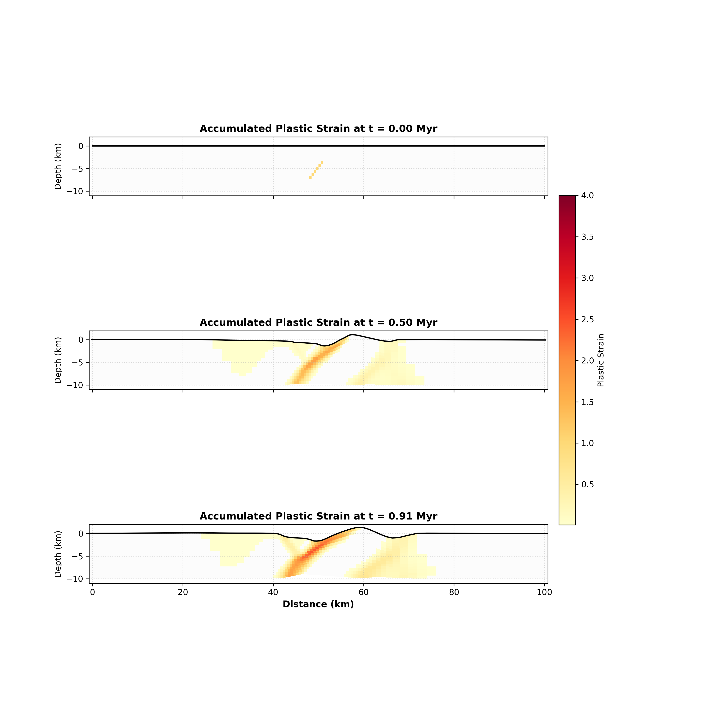

# GeoFLAC Tutorial: Metamorphic Core Complex (MCC) Extension (100x10 km Refined Grid)

This tutorial guides you through the setup, running, physical principles, and visualization of a Metamorphic Core Complex (MCC) crustal extension simulation using **GeoFLAC** configured on a refined grid with constant temperature.

---

## 1. Running the Simulation and Plotting

### Step 1: Run the GeoFLAC Solver
Clean old outputs and execute the compiled `flac` binary in the directory:
```bash
rm -f *.0 *.rs *.vts _contents.* _markers.* pisos.rs time.rs vbc.s output.asc sys.msg
../../src/flac core_complex.inp
```
The solver will run for approximately 78,500 steps, simulating a total time of **1.0 Myr** and writing output frames every **0.1 Myr**.

### Step 2: Generate the Visualization
Run the provided Python plotting script:
```bash
python3 plot_core_complex.py
```
This script reads the output files, extracts the grid coordinates, accumulated plastic strain (`aps`), lithology phases (`phase`), velocity field (`vx`, `vz`), and temperature (`temp`), and creates two premium visualizations:
1. **`images/core_complex.png`**: A detailed, publication-ready two-panel plot of the final state (0.9 Myr) showing detachment faulting, exhumation velocity vectors, and temperature isotherms.
2. **`images/evolution_core_complex.png`**: An evolutionary chart showing how the shear bands and detachment faults develop over time.

### Step 3: Convert Output to VTK Format (VTS)
To visualize the spatial distribution of stresses, strain rates, temperature, and material phases in ParaView or VisIt, convert the binary output files to `.vts` structured grid files using the provided utility:
```bash
python3 ../../util/flac2vtk.py .
```
This will generate `flac.000001.vts` to `flac.000010.vts` in your current directory.

---

## 2. Understanding the Simulation Output (output.asc)

During the simulation, GeoFLAC prints real-time logs to the screen, which are also mirrored in the [output.asc](file:///home/tan2/dv/geoflac/examples/tutorial11-core-complex/output.asc) file. Below is an explanation of these outputs:

### Startup Logs
* **`you have NEW start conditions`**: Indicates the model is starting a fresh simulation rather than resuming from a checkpoint.
* **`# of markers 11610`**: The total count of Lagrangian markers tracking material phases and properties across the domain.

### Per-Iteration Timestep Logs
```txt
        min.angle= 17.67     dt(yr)=  9.309143
```
* **`min.angle`**: The minimum internal angle (in degrees) of all sub-triangles in the mesh elements. Because elements deform with the flow, they stretch and shear. If `min.angle` drops below the critical angle set for remeshing (`angle_rem = 5.0`), it triggers a remeshing cycle to regularize the grid.
* **`dt(yr)`**: The dynamic numerical time step size in years. GeoFLAC dynamically adjusts the time step at each iteration based on stability criteria (e.g., CFL wave speed under mass scaling and Maxwell viscoelastic parameters).

### Periodic Step Summary Logs
```txt
      7300's step. Time[My]=  0.100,  elapsed sec-     2.3
```
* **`7300's step`**: The current computational loop iteration number.
* **`Time[My]`**: The cumulative physical model time in millions of years (Myr).
* **`elapsed sec`**: The total elapsed wall-clock computing time (in seconds) since the solver started.

### Remeshing Trigger Logs
* **`Remeshing due to angle required.`**: The grid elements have become too sheared (`min.angle` reached the limit), triggering a remeshing cycle.
* **`Remeshing due to shortening required.`**: The model has experienced horizontal deformation beyond the threshold set by `dx_rem`, triggering grid regularization.

---

## 3. Physical Background

A **Metamorphic Core Complex (MCC)** is a tectonic feature formed during high-magnitude crustal extension, characterized by the exhumation of middle-to-deep crustal rocks through a low-angle detachment fault system.

This tutorial explores a simplified, end-member physical configuration:
1. **Refined Grid Resolution**: High resolution in the central 20 km to resolve shear localization and fault propagation in detail, while using a very coarse grid on the outer parts to reduce computational cost.
2. **Slant Weak Zone**: An initial weak seed at the bottom of the crust extending diagonally at 45 degrees halfway up the crust. This diagonal geometry facilitates the nucleation of a single low-angle shear band.
3. **Cold Constant Thermal State**: No geothermal gradient (constant temperature of $10^\circ\text{C}$ throughout). At this low temperature, ductile creep is inactive, forcing the material to deform in a purely brittle/elasto-plastic regime.
4. **Strong Edge Materials**: To prevent spurious plastic yielding near the extensional boundaries, the crustal edges are modeled using a stronger material phase (Phase 2), while the center uses a standard strain-softening material phase (Phase 1).

```
       Extensional Velocity (<- Vx)                      Extensional Velocity (Vx ->)
            \                                                               /
             v                                                             v
             +------- Refined Central 20 km (Detachment Faulting) --------+
             |  Strong Edges  |   Center EP Softening Material    |  Strong Edges  |
             |   (Phase 2)    |   (Phase 1)                       |   (Phase 2)    |
             +~~~~~~~~~~~~~~~~~~ Slant Weak Zone (45 deg) ~~~~~~~~~~~~~~~~~+
```

---

## 4. Model Setup

### Geometry and Mesh
* **Dimensions**: $100 \text{ km}$ wide ($X \in [0, 100] \text{ km}$), $10 \text{ km}$ deep ($Z \in [-10, 0] \text{ km}$).
* **Grid Resolution**: $86 \times 15$ elements, with variable spacing in X to refine the central region and reduce resolution of the outer grid:
  - **Zone 1 (0 to 30 km)**: 15 elements (coarse, relative size 4.0).
  - **Zone 2 (30 to 40 km)**: 8 elements (gradual transition from coarse to fine).
  - **Zone 3 (40 to 60 km)**: 40 elements (fine/refined central 20 km, relative size 1.0).
  - **Zone 4 (60 to 70 km)**: 8 elements (gradual transition from fine to coarse).
  - **Zone 5 (70 to 100 km)**: 15 elements (coarse, relative size 4.0).
* **Mesh Coordinates**: Defined in `core_complex.inp`:
  ```fortran
  86,15             number of _elements_ in X and Z directions
  0.e+3,0.           x0,z0 begin.coord
  100.e+3,-10.e+3    rxbo,rzbo (100 km wide, 10 km deep)
  
  5     Number zones X-direction (0 for regular grid, or odd#)
  ; nelem_per_zone    size (relative)
   15  4
    8  0
   40  1
    8  0
   15  4
  ```

### Constant Geotherm
To investigate deformation under constant temperature, the geotherm is configured to be uniform:
* **Surface & Bottom Temperature**: $10^\circ\text{C}$ (`t_top = 10.0`, `t_bot = 10.0`)
* **Bottom Heat Boundary**: Fixed at $10^\circ\text{C}$ (`1 10.`)
* **Initial Thermal Profile**: Linear geotherm between 10°C and 10°C (resulting in a constant 10°C throughout).

### Crustal Phases and Rheology
To isolate plastic failure to the central refined domain and prevent edge yielding near boundaries, the model is divided horizontally into 3 zones using `nzone_age`, employing 2 distinct rheology materials:
1. **Central Crust (Phase 1, 30–70 km)**: Elasto-plastic (EP) with strain softening.
   * **Rheology Type (`irheol`)**: Set to `6` (Elasto-Plastic) in the input file.
   * **Strain Softening**: As plastic strain accumulates, the material weakens.
     * Cohesion decreases from $c_1 = 44 \text{ MPa}$ to $c_2 = 4 \text{ MPa}$ (`coh1 = 4.4e7`, `coh2 = 4.0e6`).
     * Friction angle is constant at $\phi_1 = \phi_2 = 30^\circ$ (`fric1 = fric2 = 30.0`).
     * Softening interval occurs over plastic strain $\epsilon_p \in [0.0, 0.1]$ (`pls1 = 0.0`, `pls2 = 0.1`).
2. **Boundary/Edge Crust (Phase 2, 0–30 km and 70–100 km)**: Stronger elasto-plastic (EP) with constant high strength to prevent edge failure.
   * **Rheology Type (`irheol`)**: Set to `6` (Elasto-Plastic).
   * **Strength Parameters**: High constant cohesion of $c_1 = c_2 = 60 \text{ MPa}$ (`coh1 = coh2 = 6.0e7`) and friction angle of $\phi_1 = \phi_2 = 40^\circ$ (`fric1 = fric2 = 40.0`).

### Lateral Heterogeneity and Column Structure (`nzone_age`)
GeoFLAC allows dividing the model domain horizontally into multiple columns (zones) using the `nzone_age` parameter. This feature is crucial for setting up lateral lithological or thermal variations:
* **`nzone_age` Syntax**: Each column is defined by three lines in `core_complex.inp`:
  1. `ictherm, age-1, tp1, tp2, ixtb1, ixtb2`: The initial geotherm type, age/parameters, and the horizontal node range boundaries (`ixtb1` to `ixtb2`) of the column.
  2. `nph_layer, hc(1), hc(2), ...`: The number of horizontal layers $N$ within this column and the depths (in km) of the interfaces between them.
  3. `iph_col(1), iph_col(2), ...`: The material phase indices for each of the $N$ layers from top to bottom.
* **Application in this Model**: We configure `nzone_age = 3` to divide the crust horizontally into 3 columns:
  - **Zone 1 (Nodes 1 to 16)**: Left boundary crust using Phase 2 (strong edge material) spanning the entire 0-10 km depth.
  - **Zone 2 (Nodes 16 to 72)**: Central crust using Phase 1 (strain-softening material) spanning the entire 0-10 km depth.
  - **Zone 3 (Nodes 72 to 87)**: Right boundary crust using Phase 2 (strong edge material) spanning the entire 0-10 km depth.

### Gravity and Lithostatic Stress
* **Gravity Acceleration (`g`)**: Configured to `10.0` $\text{m/s}^2$ (`Gravity` in the input file).
* **Lithostatic Stress**: Setting a non-zero gravity generates a vertical lithostatic stress gradient with depth ($z$):
  $$\sigma_{zz}^{litho} = -\rho g z$$
  This lithostatic gradient increases the confining pressure with depth, which increases the Mohr-Coulomb shear yield strength of the rock down-dip.

---

## 5. Boundary Conditions

The model is extended horizontally by applying constant velocities on the left and right boundaries:

1. **Left Boundary (Side 1)**: Pulling leftward at $V_x = -0.5 \text{ cm/yr} = -1.58438 \times 10^{-10} \text{ m/s}$ across all 16 nodes.
2. **Right Boundary (Side 3)**: Pulling rightward at $V_x = +0.5 \text{ cm/yr} = +1.58438 \times 10^{-10} \text{ m/s}$ across all 16 nodes.
3. **Bottom Boundary ($Z = -10\text{ km}$, Side 2)**: Configured as a **Winkler Foundation** (buoyant pressure support):
   * **Winkler boundary condition syntax**: Configured on the hydrostatic pressure line in `core_complex.inp`:
     ```fortran
     2                   0.                       2            0.            0.e+7
     ```
     representing `nyhydro, pisos, iphsub, drosub, damp_vis`:
     * `nyhydro = 2`: Auto-calculate hydrostatic pressure support. The solver computes the reference hydrostatic pressure at the bottom boundary automatically from the column of elements at the right boundary.
     * `pisos = 0.0`: Reference pressure (unused when `nyhydro = 2`).
     * `iphsub = 2`: Substratum phase (Phase 2) of the underlying mantle/inviscid fluid. The density of Phase 2 is used to calculate the buoyant restoring stress.
     * `drosub = 0.0`: Additional density difference of the fluid.
     * `damp_vis = 0.0`: Viscous damping coefficient (not used).
   * **Physical Meaning**: A Winkler foundation models the bottom boundary as being supported by an inviscid fluid (e.g., the asthenospheric mantle). The boundary is open to vertical displacement, and isostatic restoration forces are applied dynamically based on the weight of the crustal column, allowing the bottom of the crust to flex and dome upward under isostatic balance.
4. **Top Boundary (Side 4)**: Free surface with topography diffusion (`topo_removal_rate = 1.0e-7`), which simulates surface erosion and sedimentation.

---

## 6. Initial Inhomogeneities

In GeoFLAC, initial inhomogeneities can be configured to modify the phase distribution, temperature, topography, or initial accumulated plastic strain (strength weakening).

### Inhomogeneity Configuration Syntax
Inhomogeneities are defined in `core_complex.inp` under the `Initial heterogeneities` section:
* **Line 1 (`inhom`)**: Specifies the number of inhomogeneities (up to 50).
* **Following Lines**: Define each inhomogeneity with 7 parameters:
  ```fortran
  ix1   ix2   iy1   iy2   phase   geometry    init.pl.strain (amp)
  ```
  * **`ix1, ix2`**: Horizontal node/element index boundaries.
  * **`iy1, iy2`**: Vertical node/element index boundaries.
  * **`phase`**: Phase index of the anomaly. If set to `-1`, it inherits the surrounding material phase. If $> 0$, it overrides the phase in that region.
  * **`geometry`**: Geometry type of the inhomogeneity:
    - **Phase & Strength Anomalies**:
      - `0`: Rectangular weak zone/inclusion (boundaries defined by `ix1-iy1` to `ix2-iy2` elements).
      - `3`: Diagonal line weak zone/inclusion.
      - `4`: Diagonal line weak zone/inclusion plus initial plastic strain (`amp`).
    - **Thermal Anomalies** (sets temperature anomaly amplitude `amp` in °C):
      - `11`: Gaussian temperature anomaly (half-width = `ix1-ix2`, amplitude = `amp`, depth range `iy1-iy2`).
      - `13`: Right-slanting temperature anomaly.
      - `14`: Left-slanting temperature anomaly.
    - **Topography Anomalies** (adds topographic elevation `amp` in meters to surface nodes):
      - `20`: Rectangular topography step between nodes `ix1` to `ix2`.
      - `21`: Trapezoidal mountain topography between nodes `ix1` to `ix2` (slope), flat to `iy1`, down-slope to `iy2`.
    - **Viscosity Anomalies** (sets viscosity to `v-min`):
      - `100`: Rectangular low-viscosity zone.
  * **`init.pl.strain (amp)`**: Amplitude of the anomaly (e.g., initial plastic strain for geometry 0/4, temperature amplitude in °C for geometry 11/13/14, or topography elevation in meters for geometry 20/21).

### Application in this Model (The Slant Weak Seed)
To localize strain and nucleate a major detachment fault in the center of the domain, we configure a diagonal **slant weak seed** at the bottom:
```fortran
1  - inhom(number of inhomogenities)
; ix1   ix2   iy1   iy2   phase   geometry    init.pl.strain (amp)
  40    45    11     6     -1       4          1.0
```
* **Location**: $X$ spans $40 \to 45 \text{ km}$ (element indices $40 \to 45$), $Z$ spans $-10 \to -6.67 \text{ km}$ (element indices $11 \to 6$). This defines a diagonal band oriented at approximately 45 degrees, starting from the bottom of the crust and extending halfway up the crust.
* **Mechanism**: The geometry is set to `4` (diagonal line plus initial plastic strain) and the amplitude (`xinitaps`) is set to `1.0` (`init.pl.strain = 1.0`). This immediately weakens the cohesion to its residual value ($c_2 = 4\text{ MPa}$), facilitating shear localization.
* **Clean Configuration**: All unused or commented-out heterogeneity configurations have been removed from the input file.

---

## 7. EP Rheological Formulation

In Elasto-Plastic (EP) rheology, deformation is entirely accommodated by elastic strain and plastic yielding. Viscous creep is completely omitted, which is appropriate for low-temperature settings like the $10^\circ\text{C}$ crust in this model.

The total strain rate tensor is decomposed into elastic and plastic components:

$$\dot{\boldsymbol{\epsilon}} = \dot{\boldsymbol{\epsilon}}_e + \dot{\boldsymbol{\epsilon}}_p$$

During each time step, the solver performs the following steps:

### 1. Elastic Stress Trial Increment
Under Hooke's Law, the new trial stresses $\boldsymbol{\sigma}^{\text{trial}}$ are calculated assuming a purely elastic increment:

$$\sigma_{11}^{\text{trial}} = \sigma_{11} + (de_{22} + de_{33}) e_2 + de_{11} e_1$$
$$\sigma_{22}^{\text{trial}} = \sigma_{22} + (de_{11} + de_{33}) e_2 + de_{22} e_1$$
$$\sigma_{33}^{\text{trial}} = \sigma_{33} + (de_{11} + de_{22}) e_2 + de_{33} e_1$$
$$\sigma_{12}^{\text{trial}} = \sigma_{12} + 2 \mu \, de_{12}$$

Where:
* $e_1 = K + \frac{4}{3}\mu$ and $e_2 = K - \frac{2}{3}\mu$
* $K$ is the bulk modulus (`rl(iph) + 2*rm(iph)/3`)
* $\mu$ is the shear modulus (`rm(iph)`)
* $de_{ij}$ are the incremental strains over the time step $dt$.

### 2. Mohr-Coulomb Yielding and Plastic Correction
If the trial stress state violates the Mohr-Coulomb yield criterion or the tension cutoff, the stresses are mapped back to the yield surface:

$$f(\sigma_1, \sigma_3) = \sigma_3 - \sigma_1 N_\phi + 2 c \sqrt{N_\phi} = 0$$

Where:
* $N_\phi = \frac{1 + \sin\phi}{1 - \sin\phi}$
* $\phi$ is the friction angle.
* $c$ is the cohesion (which softens dynamically as a function of the accumulated plastic strain `aps` in Phase 1).
* $\sigma_1 \ge \sigma_3$ are the principal stresses (tension is positive).

If yielding occurs ($f(\boldsymbol{\sigma}^{\text{trial}}) > 0$), a plastic return mapping is performed:
1. The solver projects the stress state back to the yield envelope.
2. The plastic strain increment is accumulated into the Eulerian element's total `aps` array.

---

## 8. Analysis of Results

### Slant Fault Propagation
In the upper panel of `images/core_complex.png`, you will observe that strain localizes into a sharp, narrow shear band (detachment fault) that propagates diagonally from the **slant weak seed** at depth up to the surface.
Using a slant weak seed facilitates the nucleation of a single major low-angle detachment fault aligned with the conjugate shear direction, matching core complex geometry.



### Zero Edge Failure
Due to the high strength of the Phase 2 boundary material (friction angle of 40°, cohesion of 60 MPa), the edges are protected from yielding and remain entirely in the elastic regime during extensional pulling. Consequently, plastic strain (`aps`) at the edges is virtually zero ($< 0.01$), forcing all deformation to localize cleanly into the central region.

### Uniform Thermal State
In the lower panel, the temperature remains perfectly uniform at $10^\circ\text{C}$, showing flat, steady isotherms.

The evolutionary progress of the core complex on the refined grid is shown below:



---

> [!TIP]
> **Key takeaways for core complex physics with a variable grid:**
> * Refinement in the central 20 km allows us to capture the sharp boundaries of the detachment fault without incurring the high computational cost of refining the entire 100 km wide domain.
> * Using a stronger material phase at the boundaries is a robust way to avoid unwanted boundary edge failure in extensional lithospheric setups.
